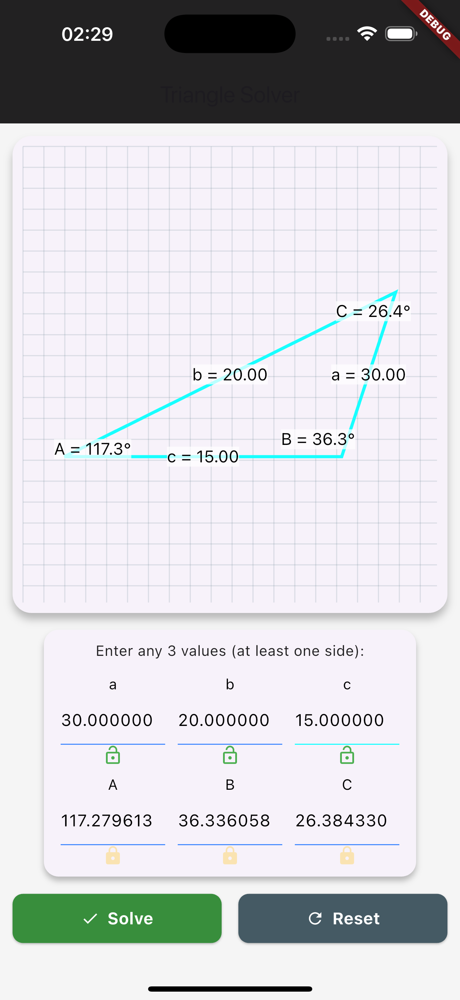
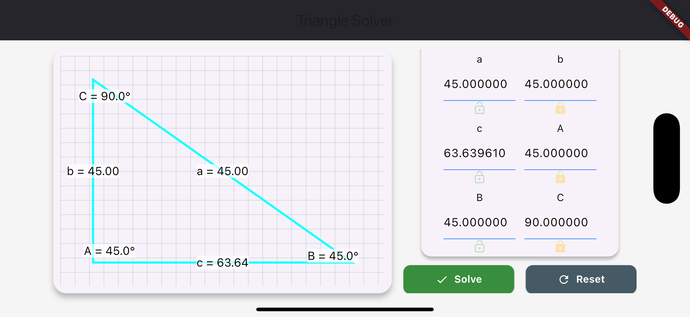

# 🔺 Triangle Solver App

A mobile app built with Flutter that solves triangles based on any 3 known parameters (sides and/or angles)

---

## ✨ Features

- 🧠 Solves triangles using classical trigonometric rules (SSS, SAS, ASA, AAS)
- 🎨 Futuristic UI with graph paper design
- 🔍 Dynamic scaling and zoom to fit triangle dimensions
- 🖊 Custom painter for grid and triangle rendering
- ⚠️ Real-time validation and error handling for invalid triangles
- 📐 Angle and side input using intuitive interface
- ✅ Built with clean architecture and Riverpod for state management

---

## 📸 Screenshots

| Portrait                             | Landscape                             |
| ------------------------------------ | ------------------------------------- |
|  |  |

---

### Run Locally

```bash
git clone https://github.com/harsi-dev/triangle_solver.git
cd triangle_solver
flutter pub get
flutter run
```
